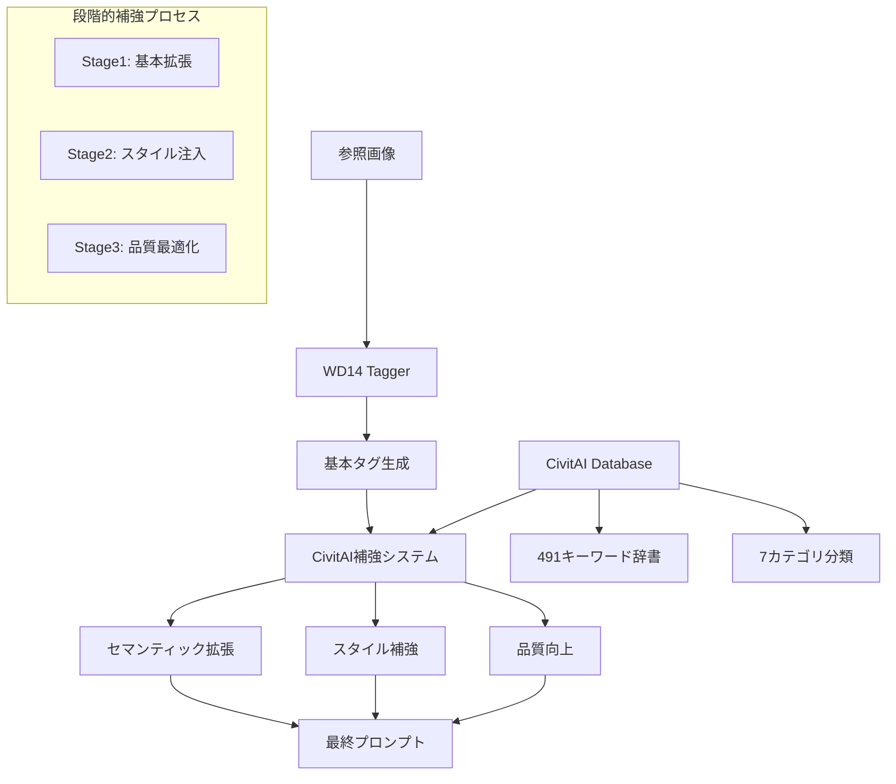

# WD14 x CivitAI プロンプト補強システム 設計書

## 🎯 概要

WD14 Taggerが生成するベーシックなタグを起点として、CivitAIから収集した高品質プロンプトデータを活用し、表現力豊かなプロンプトに段階的に拡張するシステム。

## 🔄 統合アーキテクチャ



## 🚀 実装戦略（3つのアプローチ）

### 🎨 戦略1: セマンティック類似度マッチング（推奨）

**原理**: WD14タグと類似のコンテキストを持つCivitAIプロンプトを検索し、追加表現を抽出

```python
class SemanticPromptEnhancer:
    def enhance_wd14_output(self, wd14_tags: List[str]) -> EnhancedPrompt:
        # 1. WD14タグからキーワード抽出
        base_keywords = self.extract_keywords(wd14_tags)

        # 2. CivitAI DBから類似プロンプト検索
        similar_prompts = self.search_similar_prompts(base_keywords)

        # 3. カテゴリ別補強
        enhanced = {
            'lighting': self.extract_lighting_terms(similar_prompts),
            'composition': self.extract_composition_terms(similar_prompts),
            'style': self.extract_style_terms(similar_prompts),
            'mood': self.extract_mood_terms(similar_prompts),
            'technical': self.merge_technical_quality(wd14_tags, similar_prompts)
        }

        return self.combine_prompts(wd14_tags, enhanced)
```

**メリット**:
- 高精度な拡張が可能
- WD14の出力を最大限活用
- 段階的な調整が容易

### 🔍 戦略2: カテゴリ別補完システム

**原理**: WD14で不足する特定カテゴリ（ライティング、ムード、構図）を集中的に補強

```python
class CategoryBasedEnhancer:
    def __init__(self):
        self.category_weights = {
            'lighting': 0.3,    # WD14で最も不足
            'mood': 0.25,       # 雰囲気表現が弱い
            'composition': 0.2, # 構図指定が限定的
            'style': 0.15,      # スタイル語彙不足
            'technical': 0.1    # WD14で十分カバー
        }

    def enhance_by_category(self, wd14_tags: List[str]) -> Dict[str, List[str]]:
        scene_type = self.detect_scene_type(wd14_tags)  # portrait, landscape, etc.

        enhancements = {}
        for category, weight in self.category_weights.items():
            candidates = self.get_category_candidates(category, scene_type)
            selected = self.select_best_candidates(candidates, wd14_tags, weight)
            enhancements[category] = selected

        return enhancements
```

### 🎯 戦略3: 品質スコア誘導システム

**原理**: CivitAIの品質スコアリング機能を活用し、WD14出力を高品質プロンプトの方向に誘導

```python
class QualityGuidedEnhancer:
    def enhance_with_quality_guidance(self, wd14_tags: List[str]) -> PromptCandidate:
        base_score = self.calculate_quality_score(' '.join(wd14_tags))

        # 品質向上のための候補生成
        candidates = []
        for enhancement_type in ['lighting', 'detail', 'style', 'technical']:
            enhanced = self.add_enhancement(wd14_tags, enhancement_type)
            score = self.calculate_quality_score(' '.join(enhanced))
            candidates.append(PromptCandidate(enhanced, score, enhancement_type))

        # 最適な組み合わせを選択
        return self.select_optimal_combination(candidates)
```

## 🛠 具体的な実装計画

### Phase 1: 基盤システム構築（1-2週間）

1. **WD14インターフェース開発**
```python
class WD14Interface:
    def process_image(self, image_path: str) -> WD14Output:
        """画像からWD14タグを生成"""
        pass

    def parse_tags(self, raw_output: str) -> ParsedTags:
        """WD14の出力をパース・正規化"""
        pass
```

2. **CivitAIデータ準備**
```python
class PromptDatabase:
    def build_semantic_index(self):
        """セマンティック検索用インデックス構築"""
        pass

    def create_category_mappings(self):
        """カテゴリ別キーワードマッピング"""
        pass
```

### Phase 2: 補強アルゴリズム実装（2-3週間）

1. **類似度計算エンジン**
```python
from sentence_transformers import SentenceTransformer

class SemanticMatcher:
    def __init__(self):
        self.model = SentenceTransformer('all-MiniLM-L6-v2')

    def find_similar_prompts(self, wd14_tags: List[str], top_k=10):
        query_embedding = self.model.encode(' '.join(wd14_tags))
        # CivitAI プロンプトとの類似度計算
        return similar_prompts
```

2. **補強ルールエンジン**
```python
class EnhancementRules:
    def apply_lighting_rules(self, base_tags: List[str], scene_type: str):
        """シーンタイプに応じたライティング補強"""
        pass

    def apply_composition_rules(self, base_tags: List[str], subject_count: int):
        """被写体数に応じた構図補強"""
        pass
```

### Phase 3: ComfyUI統合（1-2週間）

**新しいComfyUIノードの設計:**

1. **WD14EnhancedTaggerNode**
   - WD14 + CivitAI補強を一体化
   - リアルタイム補強設定
   - 段階的調整スライダー

2. **PromptEnhancementNode**
   - 既存プロンプトの改良
   - カテゴリ別強度調整
   - A/Bテスト機能

3. **PromptStyleTransferNode**
   - 特定スタイルへの変換
   - アーティスト・ムード指定
   - 品質グレード設定

## 📊 期待される効果

### Before（WD14単体）
```
"1girl, long hair, blonde hair, blue eyes, dress, standing"
```

### After（CivitAI補強）
```
"masterpiece, best quality, 1girl, long hair, blonde hair, blue eyes,
elegant dress, standing gracefully, soft lighting, golden hour,
cinematic composition, detailed fabric texture, gentle expression,
depth of field, professional photography, high resolution"
```

**改善点:**
- 技術的品質向上: `masterpiece, best quality, high resolution`
- ライティング追加: `soft lighting, golden hour`
- 構図・演出: `cinematic composition, depth of field`
- 詳細表現: `detailed fabric texture, gentle expression`

## 🎛 実装優先順位

### 🚀 最優先（即効性重視）
1. **カテゴリ別キーワード注入** - 既存の491キーワード辞書を活用
2. **品質タグ自動追加** - `masterpiece, best quality` 系の定型強化
3. **ライティング補強** - 最も効果的で実装が容易

### 🔄 中期（バランス重視）
1. **セマンティック類似検索** - より自然な拡張
2. **動的重み調整** - ユーザー好みの学習
3. **A/Bテスト機能** - 効果測定

### 🎯 長期（高度化）
1. **機械学習による最適化** - GPT/Transformerモデル統合
2. **スタイル転送** - 特定アーティストスタイルへの変換
3. **インタラクティブ調整** - リアルタイム微調整UI

## 💡 運用での工夫

### 段階的品質向上
1. **Level 1**: 基本品質タグ追加（即座に効果）
2. **Level 2**: カテゴリ別補強（表現幅拡大）
3. **Level 3**: セマンティック最適化（自然な仕上がり）

### ユーザビリティ考慮
- **プリセット提供**: Portrait, Landscape, Anime, Realistic等
- **強度調整**: 0-100%スライダーで補強レベル制御
- **履歴機能**: 成功パターンの学習・再利用

## 🎯 結論

**推奨アプローチ**: **段階的実装**で、カテゴリ別補強→セマンティック検索→品質最適化の順で開発

この手法により、WD14の基本性能を維持しながら、CivitAIの豊富な表現データを活用して、大幅な品質向上が期待できます。
